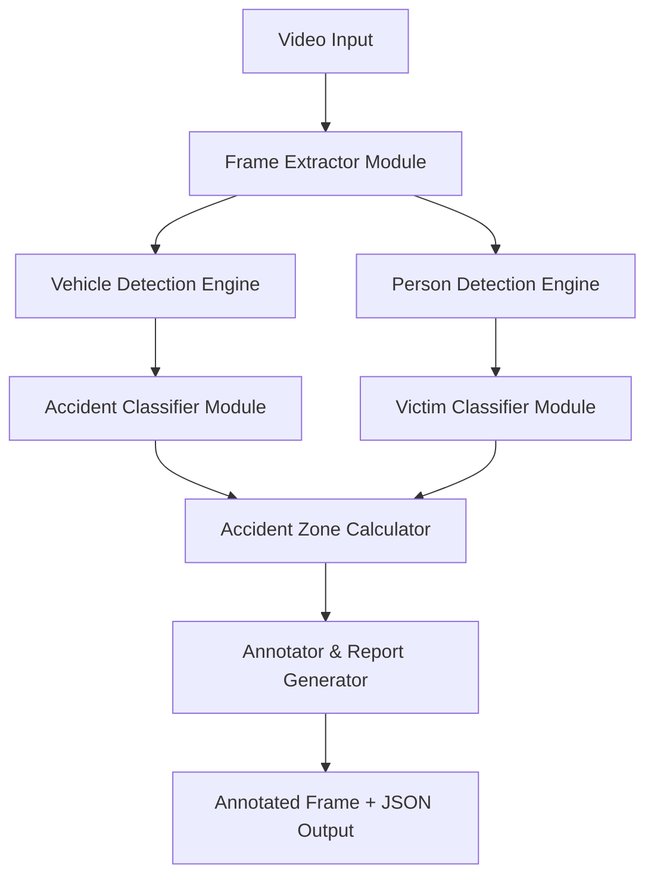

# RapidAid — Implementation Plan

## Problem Analysis

After analyzing your existing Colab notebook, I've identified these **core problems** and their root causes:

| # | Problem | Root Cause |
|---|---------|-----------|
| 1 | Can't reliably detect only vehicles **involved** in the accident | Rule-based IoU/proximity alone is fragile; `is_deformed()` only works for cars with extreme aspect ratios; no crash-specific visual cues are used |
| 2 | Can't distinguish victims from bystanders | Pose estimation alone isn't enough — "flat" ratio (`w/h > 0.85`) is too coarse; standing/lying classification needs skeleton keypoints, not just bbox ratios |
| 3 | Accident zone is inconsistent (too large / too small) | Zone is computed from **all** involved entities — if vehicle/victim detection is wrong, zone is wrong. It's a downstream effect of problems 1 & 2 |
| 4 | No training dataset | Relied entirely on pretrained COCO weights; no accident-specific fine-tuning |
| 5 | Can't use VLMs (too slow) | Correct — we'll stay with YOLO-family models for real-time performance |

## Proposed Architecture — Modular Pipeline

The key insight: **separate each task into its own specialized module**, so each can be improved/replaced independently.



### Module Breakdown

| Module | Model | Purpose | Runs On |
|--------|-------|---------|---------|
| **Vehicle Detection Engine** | YOLOv8s-seg (pretrained) | Detect ALL vehicles with segmentation masks | GPU (Colab) / CPU (local) |
| **Person Detection Engine** | YOLOv8s-pose (pretrained) | Detect ALL persons with skeleton keypoints | GPU (Colab) / CPU (local) |
| **Accident Classifier** | Custom binary classifier (fine-tuned YOLOv8n-cls **or** rule-based + heuristics) | Classify: "is this pair of vehicles involved in a crash?" | GPU for training, CPU for inference |
| **Victim Classifier** | Pose-based heuristic engine (improved) | Classify each person as victim/bystander using keypoints | CPU |
| **Accident Zone Calculator** | Geometric algorithm (improved) | Compute tight, consistent bounding zone | CPU |
| **Frame Extractor** | Optical flow / frame differencing | Find the "best" accident frame from video | CPU |
| **Annotator** | OpenCV drawing + JSON builder | Produce final annotated frame + structured JSON | CPU |

---

## Datasets for Training/Fine-Tuning

> [!IMPORTANT]
> These datasets will significantly improve detection accuracy. You'll need GPU (Colab) to train on them.

### Recommended Datasets

| Dataset | Source | Size | Use For |
|---------|--------|------|---------|
| **CADP (Car Accident Detection & Prediction)** | Kaggle | ~1500 accident frames | Accident vs non-accident classification |
| **Accident Detection from CCTV** | Roboflow | ~3000+ annotated frames | Vehicle damage detection, accident scene classification |
| **GRAZPEDWRI-DX** (accident scenarios) | Roboflow | Varies | Accident scene object detection |
| **US-Accidents** (contextual) | Kaggle | 7.7M records | Metadata enrichment (severity, conditions) |
| **DoTA (Detection of Traffic Anomaly)** | GitHub/Academic | 4,677 videos | Temporal accident detection from video |
| **CCD (Car Crash Dataset)** | Academic | 1500+ videos | Video-level accident detection |

### How to Use Them (GPU Required)

1. **Fine-tune YOLOv8n-cls** on CADP/CCTV accident datasets → binary "accident/no-accident" classifier for cropped vehicle regions
2. **Train a small CNN** (ResNet18) on cropped vehicle pairs → "involved/not-involved" classification
3. **No full re-training of detection models needed** — we keep pretrained YOLOv8s-seg and YOLOv8s-pose as-is

---

## Project Folder Structure

```
AccidentDetection/
├── config/
│   ├── settings.py              # All thresholds, paths, constants
│   └── vehicle_classes.py       # COCO class mappings
├── models/
│   ├── __init__.py
│   ├── vehicle_detector.py      # Vehicle detection engine (YOLOv8s-seg)
│   ├── person_detector.py       # Person detection engine (YOLOv8s-pose)
│   ├── accident_classifier.py   # Accident involvement classifier
│   ├── victim_classifier.py     # Victim vs bystander classifier
│   └── accident_zone.py         # Accident zone computation
├── pipeline/
│   ├── __init__.py
│   ├── frame_processor.py       # Single-frame analysis pipeline
│   ├── video_processor.py       # Video analysis (frame extraction + processing)
│   └── report_generator.py      # JSON report + annotated frame generation
├── utils/
│   ├── __init__.py
│   ├── geometry.py              # IoU, distance, polygon operations
│   ├── visualization.py         # Drawing/annotation functions
│   └── helpers.py               # General utilities
├── weights/                     # Model weight files (gitignored)
│   ├── yolov8s-seg.pt
│   ├── yolov8s-pose.pt
│   └── accident_classifier.pt   # (After GPU training)
├── data/
│   ├── test_frames/             # Test images
│   └── test_videos/             # Test videos
├── outputs/
│   ├── annotated/               # Output annotated frames
│   └── reports/                 # Output JSON reports
├── notebooks/
│   └── training.ipynb           # Colab notebook for GPU training
├── main.py                      # CLI entry point
├── requirements.txt
└── README.md
```

---

## Proposed Changes — Detailed Module Specs

### 1. `config/settings.py` — Centralized Configuration

All magic numbers in one place. This solves the "inconsistent thresholds" problem.

```python
# Key thresholds (all tunable)
MIN_VEHICLE_AREA_RATIO = 0.02       # Vehicle must be > 2% of frame
COLLISION_IOU_THRESHOLD = 0.04       # Mask overlap for collision
PROXIMITY_RATIO = 0.3               # Edge distance / diagonal ratio
DEFORMATION_RATIOS = {               # Per-vehicle-type aspect ratios
    "car": (0.55, 3.0),
    "truck": (0.4, 4.0),
    "bus": (0.3, 5.0),
    # ... more types
}
VICTIM_STANDING_RATIO = 1.3          # h/w > 1.3 = standing
VICTIM_OVERLAP_THRESHOLD = 0.35      # Person-vehicle overlap
VICTIM_PROXIMITY_MULTIPLIER = 1.2    # Zone proximity
ACCIDENT_ZONE_PADDING = 0.05         # 5% padding
```

---

### 2. `models/vehicle_detector.py` — Improved Vehicle Detection

**Key improvements over current code:**
- Filter background vehicles using **area + position** (not just area)
- Score vehicles by "crash likelihood" using multiple signals
- Support extended vehicle types: `car`, `motorcycle`, `bus`, `truck`, `auto-rickshaw`, `bicycle`

---

### 3. `models/accident_classifier.py` — Crash Involvement Scoring

**This is the biggest improvement.** Instead of simple IoU binary check, we compute a **crash score** per vehicle pair using multiple signals:

| Signal | Weight | Description |
|--------|--------|-------------|
| Mask overlap (pixel collision) | 0.35 | Segmentation mask intersection |
| Bounding box IoU | 0.15 | Standard IoU |
| Edge proximity ratio | 0.15 | How close edges are relative to vehicle size |
| Aspect ratio anomaly | 0.10 | Deformation detection |
| Relative angle | 0.10 | Vehicles at unusual angles to each other |
| Scene position | 0.10 | Are they in the road center vs. parked at edges? |
| Damage context | 0.05 | Debris, glass detection (if available) |

A pair with **crash_score > threshold** is flagged as involved.

> [!TIP]
> The custom accident classifier (trained on GPU with accident datasets) replaces the rule-based scoring and achieves much higher accuracy. The rule-based system serves as a reliable fallback.

---

### 4. `models/victim_classifier.py` — Improved Victim Detection

**Key improvements using pose keypoints (not just bbox ratio):**

| Check | Logic |
|-------|-------|
| Standing detection | If hip-to-ankle keypoints are roughly vertical AND confidence > threshold → **bystander** |
| Lying detection | If shoulder-hip-knee keypoints are roughly horizontal → **potential victim** |
| Trapped detection | Person mask overlaps vehicle mask by > 35% → **trapped victim** |
| Zone proximity | Non-standing person's center inside accident zone → **fallen victim** |
| Motion context (video) | Person moving toward scene = helper; stationary on ground = victim |

---

### 5. `models/accident_zone.py` — Consistent Zone Computation

**Improvements:**
- Zone is computed from **confirmed involved vehicles only** (not all vehicles)
- Adaptive padding based on vehicle sizes (not fixed percentage)
- Zone must be at least as large as the largest involved vehicle
- Zone is clipped to road boundaries (if detectable)
- Minimum zone size enforced

---

### 6. `pipeline/video_processor.py` — Smart Frame Extraction

For video processing:
1. Use **frame differencing** to detect sudden motion changes (potential crash moment)
2. Score each frame using a lightweight "suspicion score" (optical flow magnitude spike)
3. When suspicion triggers, run the **full pipeline** on that frame
4. Continue scanning for a few more frames to find the **best** accident frame
5. Return the frame with highest confidence

---

### 7. `pipeline/frame_processor.py` — Single Frame Pipeline

Orchestrates all modules for one frame:

```
Frame → Vehicle Detection → Person Detection → Accident Classification →
Victim Classification → Zone Computation → Annotation → JSON Report
```

---

## Verification Plan

### Automated Tests
- Unit tests for each module (geometry, classification logic)
- Integration test: process test frames, verify JSON output structure
- Regression test: compare outputs against known-good results

### Manual Verification
- Test with 5-10 different accident video types:
  - Car-car collision
  - Car-motorcycle collision
  - Multi-vehicle pileup
  - Pedestrian hit by vehicle
  - Truck accident
  - Bicycle accident
- Verify annotated frames visually
- Check JSON report accuracy

---

## GPU Training Workflow

When you're ready to train custom models on GPU (Colab):

1. I'll provide a **training notebook** (`notebooks/training.ipynb`)
2. You'll download datasets from Roboflow/Kaggle
3. Run training in Colab (Tesla T4 GPU)
4. Download the trained `.pt` weight file
5. Place it in `weights/` directory
6. The pipeline automatically uses the custom model if available

---

## Open Questions

> [!IMPORTANT]
> **Q1:** For the video processing feature — should the system process the **entire video** and find ALL accident frames, or stop at the **first confirmed accident** (as your current code does)?

> [!IMPORTANT]
> **Q2:** Do you want the system to run as a **CLI tool** (e.g., `python main.py --input video.mp4`) or also as a **web interface**? For now I'll build CLI only.

> [!IMPORTANT]
> **Q3:** For vehicle types — should we also detect **auto-rickshaws** (common in India) and **bicycles**, or stick to the standard COCO classes (car, motorcycle, bus, truck, train)?

> [!IMPORTANT]
> **Q4:** The current code uses `yolov8s-seg` and `yolov8s-pose` (small variants). These work well on GPU but may be slower on CPU. Should I also support `yolov8n` (nano) variants for faster CPU inference, with slightly lower accuracy?

---

## Execution Order

1. ✅ Create project folder structure
2. ✅ Implement `config/` modules
3. ✅ Implement `utils/` modules (geometry, visualization)
4. ✅ Implement `models/` modules (all 5 detection/classification engines)
5. ✅ Implement `pipeline/` modules (frame processor, video processor, report generator)
6. ✅ Implement `main.py` CLI entry point
7. ✅ Create `requirements.txt`
8. ✅ Create training notebook for GPU work
9. 🔄 Test with sample frames/videos
10. 🔄 Fine-tune thresholds based on results
